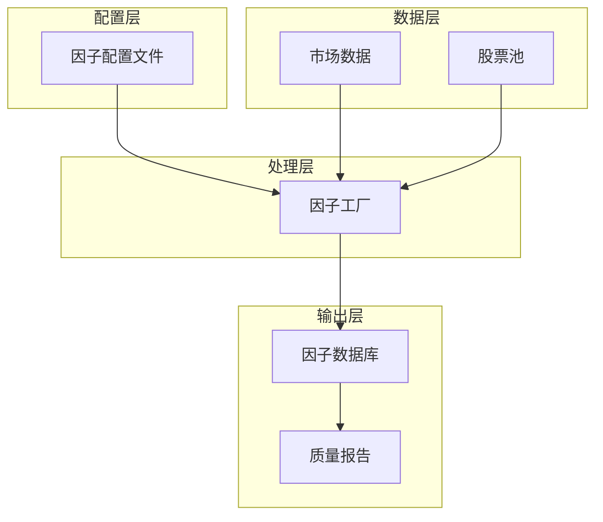
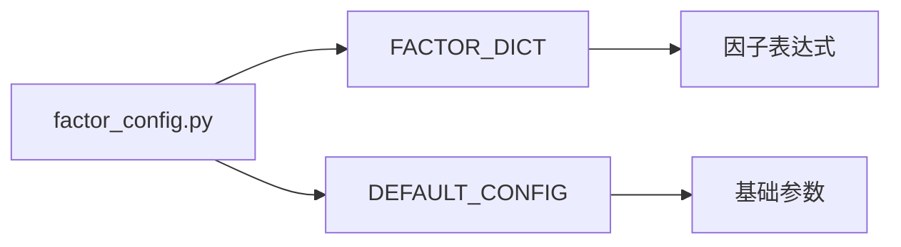
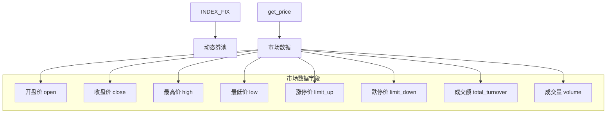
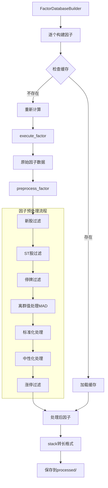
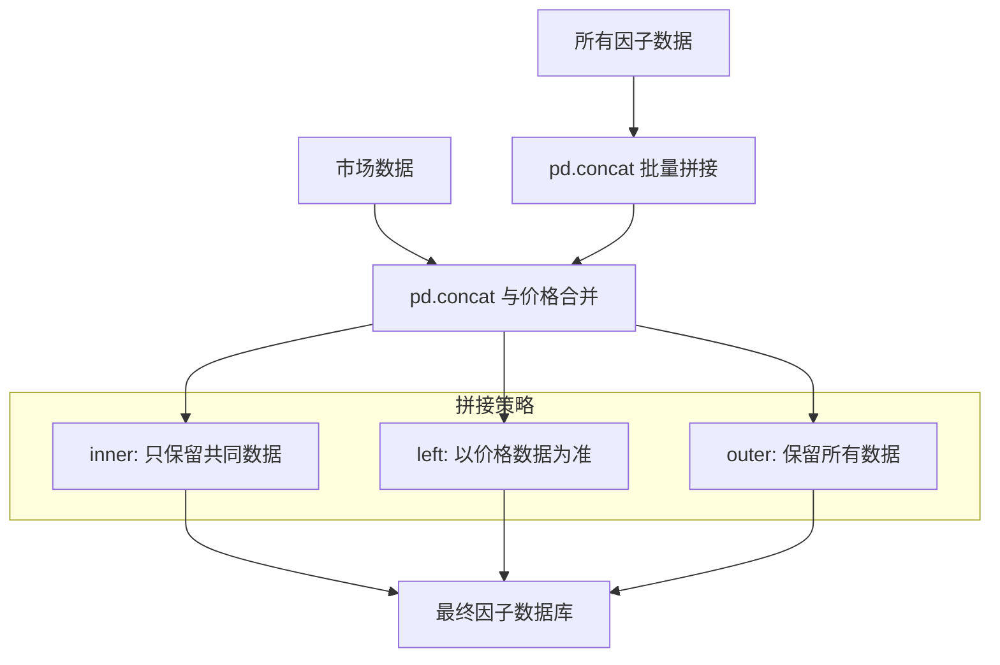
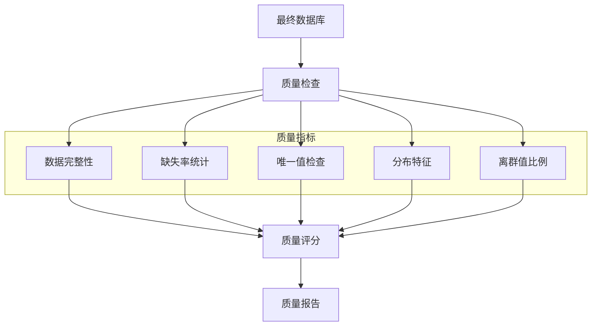
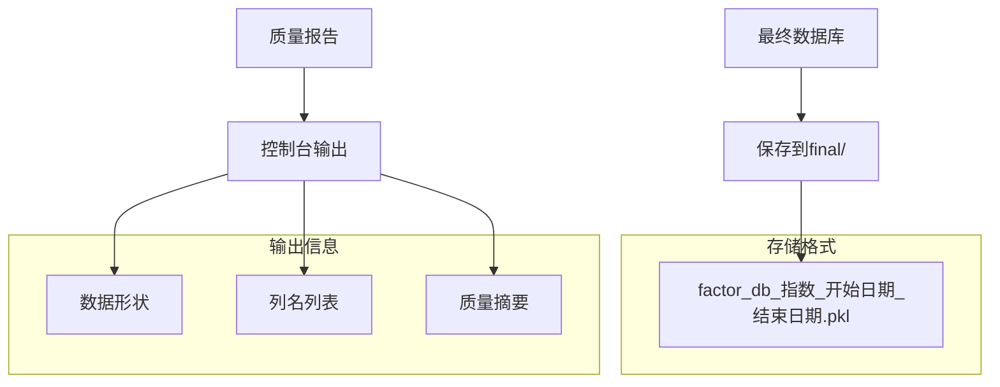
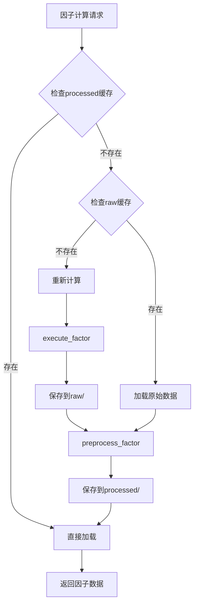
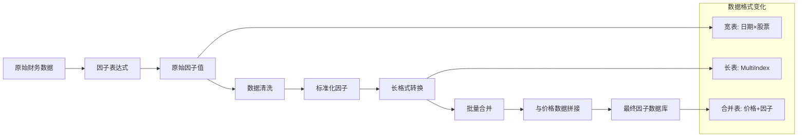

# 因子数据库构建流程

## 总体架构



## 文件结构

```
alpha_local/
├── factor_config.py           # 因子配置文件
├── factor_database_builder.py # 因子数据库构建器类
├── feval_factor_database.py   # 执行文件(因子工厂)
├── factor_processing_utils.py  # 因子处理工具函数
└── factor_lib/                # 数据存储目录
    ├── raw/                   # 原始因子数据
    ├── processed/             # 预处理后因子数据
    └── final/                 # 最终因子数据库
```

## 核心流程

### 1. 配置加载阶段


**输入**：
- 因子定义字典 `FACTOR_DICT`
- 基础配置 `DEFAULT_CONFIG`

**输出**：
- 因子表达式列表
- 时间范围、股票池等参数

### 2. 数据准备阶段


**输入**：
- 时间范围：`start_date` → `end_date`
- 指数代码：`index_item`

**输出**：
- 股票池：`stock_universe` (日期 × 股票)
- 市场数据：`market_data` (MultiIndex格式)

### 3. 因子构建阶段


**核心步骤**：
1. **缓存检查**：避免重复计算
2. **原始计算**：`execute_factor()` 执行因子表达式
3. **数据清洗**：`preprocess_factor()` 多重过滤和处理
4. **格式转换**：宽表 → 长表 (MultiIndex)
5. **缓存保存**：存储到 `processed/` 目录

### 4. 数据合并阶段


**输入**：
- 多个因子的长格式数据
- 市场数据 (价格、成交量等)

**输出**：
- 统一的因子数据库 DataFrame
- 索引：(股票代码, 日期)
- 列：价格字段 + 因子字段

### 5. 质量检查阶段


**质量评估标准**：
- 缺失率 < 20%：满分
- 缺失率 20-50%：扣15分
- 缺失率 > 50%：扣30分
- 离群值 > 10%：扣20分
- 唯一值 < 10%：扣15分

### 6. 结果保存阶段


## 缓存机制



**缓存层级**：
1. **Level 1**: `processed/` - 完全处理好的因子
2. **Level 2**: `raw/` - 原始计算结果
3. **Level 3**: `final/` - 最终数据库

## 数据流转



## 配置参数

### 核心配置
```python
DEFAULT_CONFIG = {
    "start_date": "2015-01-01",     # 开始日期
    "end_date": "2025-07-01",       # 结束日期  
    "index_item": "000852.XSHG",    # 指数代码(中证1000)
    "join_type": "inner",           # 合并方式
    "force_rebuild": False,         # 是否强制重建
    "cache_dir": "factor_lib"       # 缓存目录
}
```

### 因子定义
```python
FACTOR_DICT = {
    "cfoa_mrq": 经营性现金流/总资产,      # 现金流资产比
    "atdy_mrq": 资产周转率同比变化,        # 运营效率
    "ccr_mrq": 经营性现金流/流动负债,      # 偿债能力
}
```

## 使用方式

### 快速开始
```python
# 1. 运行因子工厂
python feval_factor_database.py

# 2. 或者在代码中调用
from feval_factor_database import factor_factory
df, report = factor_factory()
```

### 自定义使用
```python
from factor_database_builder import FactorDatabaseBuilder
from factor_config import FACTOR_DICT, DEFAULT_CONFIG

# 创建构建器
builder = FactorDatabaseBuilder()

# 自定义参数
df, report = builder.build_factor_database(
    factor_dict=FACTOR_DICT,
    # ... 其他参数
    force_rebuild=True  # 强制重建
)
```

## 扩展指南

### 添加新因子
1. 在 `factor_config.py` 中添加因子定义
2. 重新运行 `feval_factor_database.py`
3. 系统自动处理新因子

### 修改处理逻辑
1. 编辑 `factor_processing_utils.py` 中的处理函数
2. 设置 `force_rebuild=True` 重新处理

### 性能优化
1. **并行计算**：多进程处理多个因子
2. **增量更新**：只计算新增时间段
3. **内存优化**：使用 float32 减少内存使用

## 输出示例

```
准备动态券池
获取市场数据  
加载因子配置文件
加载了 3 个因子: ['cfoa_mrq', 'atdy_mrq', 'ccr_mrq']

开始构建因子数据库，共 3 个因子
时间范围: 2015-01-01 到 2025-07-01
股票数量: 2686

[1/3] 处理因子: cfoa_mrq
加载缓存因子: cfoa_mrq

[2/3] 处理因子: atdy_mrq  
加载缓存因子: atdy_mrq

[3/3] 处理因子: ccr_mrq
加载缓存因子: ccr_mrq

拼接 3 个因子...
合并价格数据，使用 inner 连接...
生成质量报告...
质量摘要: 平均分 100.0, 优良因子 3/3
保存最终数据库...
构建完成！
   最终数据: 2397832 行 × 11 列
   文件大小: 245.8 MB
   保存路径: factor_lib/final/factor_db_000852.XSHG_2015-01-01_2025-07-01.pkl

最终结果:
数据形状: (2397832, 11)
列名: ['open', 'close', 'high', 'low', 'limit_up', 'limit_down', 
       'total_turnover', 'volume', 'cfoa_mrq', 'atdy_mrq', 'ccr_mrq']
```

---

*这套因子数据库构建系统具有高度的模块化、可扩展性和容错性，支持大规模因子的批量处理和管理。*
